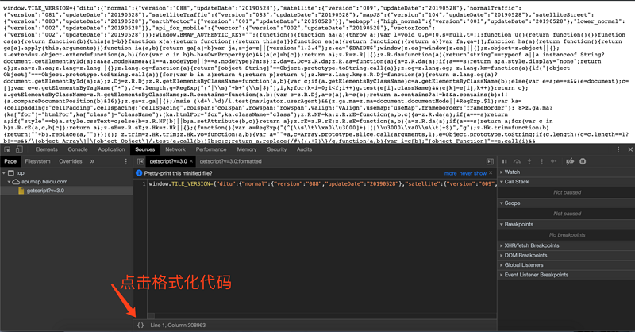
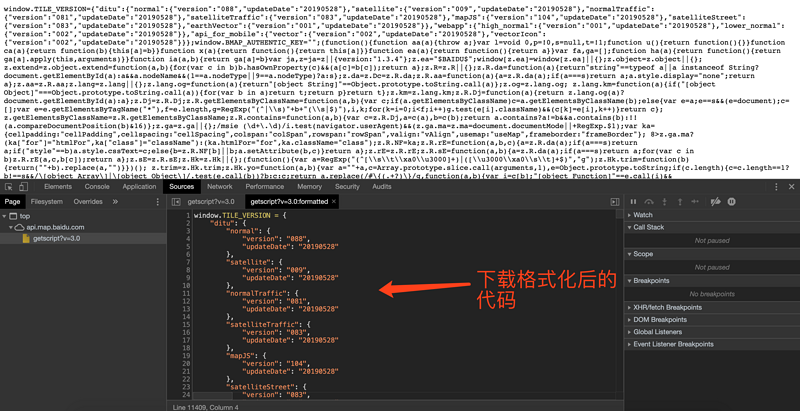
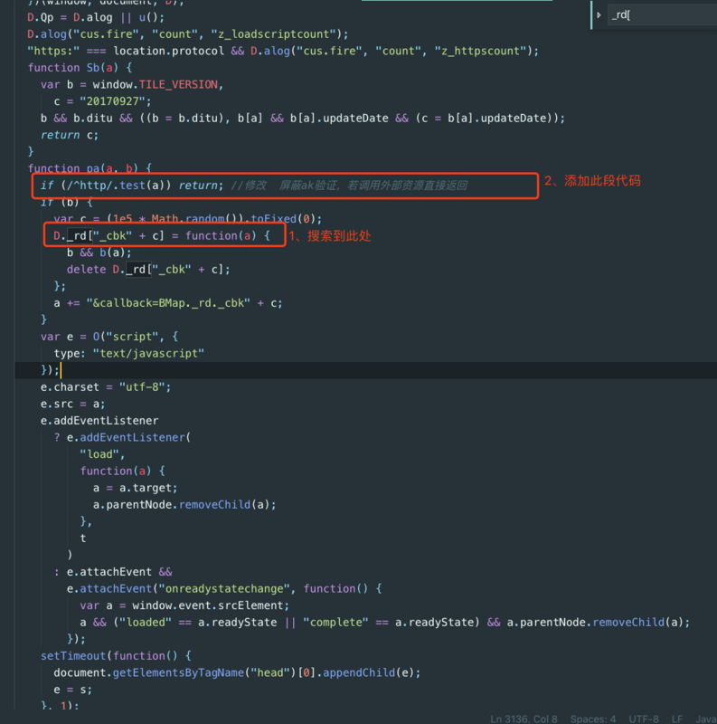
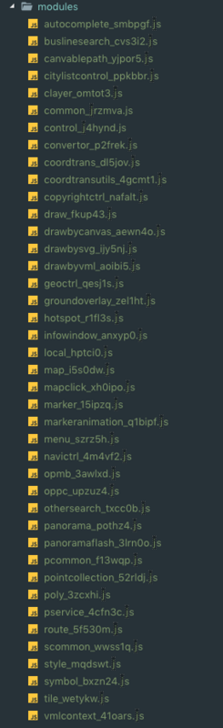
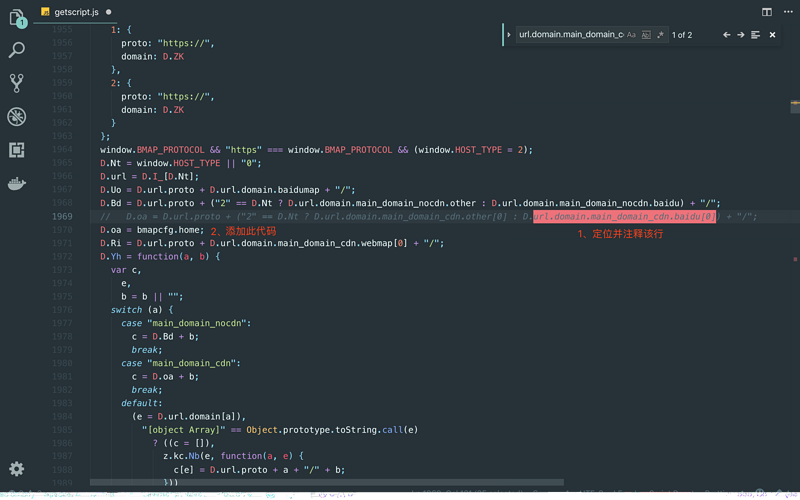
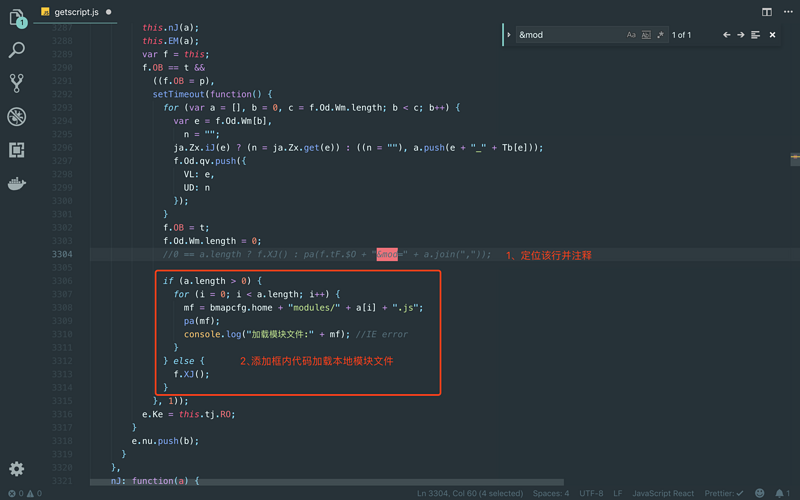
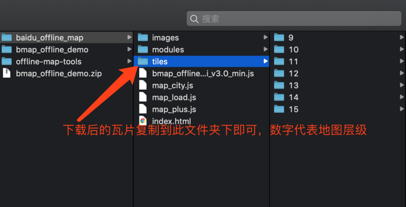
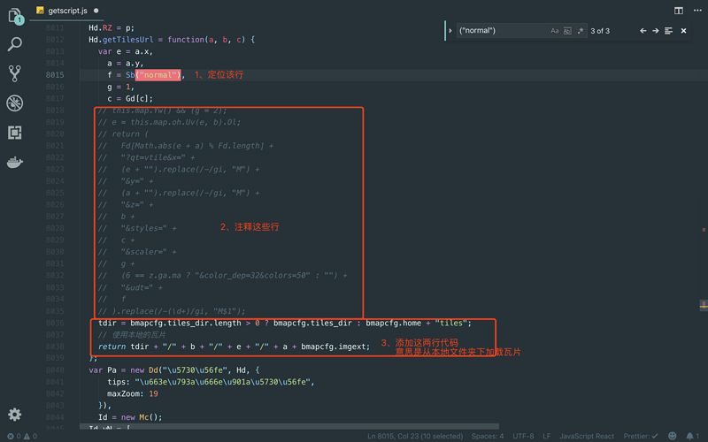
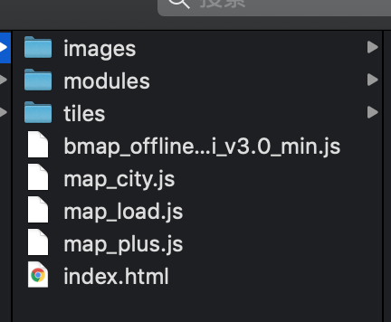

# 百度离线地图的制作思路


制作百度离线地图分为 6 步：

1. 下载百度 JS API 文件为本地文件

2. 屏蔽百度 ak 验证

3. 引用本地模块资源

4. 下载所需地区的瓦片图

5. 编写 index.html 文件并预览

[百度离线地图效果访问地址](https://yibiubiu666.github.io/bmap-offline-demo.github.io/index.html)

---

## 1 现在百度地图 JS API 文件为本地文件

访问 [百度地图 JS API](http://api.map.baidu.com/api?v=3.0) 地址，代码如下：

``` js
(function() {
    window.BMap_loadScriptTime = (new Date).getTime();

    document.write('<script type="text/javascript" src="http://api.map.baidu.com/getscript?v=3.0&ak=&services=&t=20190527152033"></script>');
})();
```

然后复制上面代码中的 [http://api.map.baidu.com/gets...](http://api.map.baidu.com/getscript?v=3.0&ak=&services=&t=20190527152033)，并访问该网址，如图所示：





打开之后我们格式化代码并下载该文件，文件暂时命名为：map_offline_api_v3.0_min.js

---

## 2 屏蔽百度 ak 验证

打开 map_offline_api_v3.0_min.js 文件，如下



---

## 3 引用本地模块资源

百度地图提供的各种图层类，标记类，控件类等等都可以看作是modules,当你在地图中用到这些模块时，它会自动加载，因此我们需要先把这些模块的js文件下载下来，保存到本地。定位到下面代码，没数错的话，一共是41个模块

``` js
var Tb = {
    map: "i5s0dw", //map_i5s0dw
    common: "jrzmva", //common_jrzmva
    style: "mqdswt", //style_mqdswt
    tile: "wetykw", //tile_wetykw
    groundoverlay: "zel1ht", //groundoverlay_zel1ht
    pointcollection: "52rldj", //pointcollection_52rldj
    marker: "15ipzq", //marker_15ipzq
    symbol: "bxzn24", //symbol_bxzn24
    canvablepath: "yjpor5", //canvablepath_yjpor5
    vmlcontext: "41oars", //vmlcontext_41oars
    markeranimation: "q1bipf", //markeranimation_q1bipf
    poly: "3zcxhi", //poly_3zcxhi
    draw: "fkup43", //draw_fkup43
    drawbysvg: "ijy5nj", //drawbysvg_ijy5nj
    drawbyvml: "aoibi5", //drawbyvml_aoibi5
    drawbycanvas: "aewn4o", //drawbycanvas_aewn4o
    infowindow: "anxyp0", //infowindow_anxyp0
    oppc: "upzuz4", //oppc_upzuz4
    opmb: "3awlxd", //opmb_3awlxd
    menu: "szrz5h", //menu_szrz5h
    control: "j4hynd", //control_j4hynd
    navictrl: "4m4vf2", //navictrl_4m4vf2
    geoctrl: "qesj1s", //geoctrl_qesj1s
    copyrightctrl: "nafalt", //copyrightctrl_nafalt
    citylistcontrol: "ppkbbr", //citylistcontrol_ppkbbr
    scommon: "wwss1q", //scommon_wwss1q
    local: "hptci0", //local_hptci0
    route: "5f530m", //route_5f530m
    othersearch: "txcc0b", //othersearch_txcc0b
    mapclick: "xh0ipo", //mapclick_xh0ipo
    buslinesearch: "cvs3i2", //buslinesearch_cvs3i2
    hotspot: "r1fl3s", //hotspot_r1fl3s
    autocomplete: "smbpgf", //autocomplete_smbpgf
    coordtrans: "dl5jov", //coordtrans_dl5jov
    coordtransutils: "4gcmt1", //coordtransutils_4gcmt1
    convertor: "p2frek", //convertor_p2frek
    clayer: "omtot3", //clayer_omtot3
    pservice: "4cfn3c", //pservice_4cfn3c
    pcommon: "f13wqp", //pcommon_f13wqp
    panorama: "pothz4", //panorama_pothz4
    panoramaflash: "3lrn0o" //panoramaflash_3lrn0o
  };
```

这时候就可以创建 modules 文件夹，添加所需模块的 js 文件，注意命名格式，js 代码可以这么获取：

```js
http://api0.map.bdimg.com/getmodules?v=3.0&mod=map_i5s0dw
```

保存js文件时文件名也是这样如：map_i5s0dw.js



为了便于修改主文件里的一些内容，先创建一个 map_load.js 文件，加入下面代码：

```js
window.bmapcfg = {
  'imgext'      : '.jpg',   //瓦片图的后缀  根据需要修改，一般是 .png .jpg
  'tiles_dir'   : '',       //普通瓦片图的地址，为空默认在tiles/ 目录
};

var scripts = document.getElementsByTagName("script");
var JS__FILE__ = scripts[scripts.length - 1].getAttribute("src");  //获得当前js文件路径
bmapcfg.home = JS__FILE__.substr(0, JS__FILE__.lastIndexOf("/")+1); //地图API主目录
(function(){
  window.BMap_loadScriptTime = (new Date).getTime();
  //加载地图API主文件
  document.write('<script type="text/javascript" src="'+bmapcfg.home+'bmap_offline_api_v3.0_min.js"></script>');
```

在 bmap_offline_api_v3.0_min.js 文件中定位到

```js
D.oa = D.url.proto + ("2" == D.Nt ? D.url.domain.main_domain_cdn.other[0] : D.url.domain.main_domain_cdn.baidu[0]) + "/";
```

将其所在行注释掉，加上这行

```js
D.oa = bmapcfg.home; //添加本地工具资源引用(离线路径)
```

如图：



然后再通过 &mod 进行定位，注释掉其所在行，做如下修改：



```js
//   0 == a.length ? f.XJ() : pa(f.tF.$O + "&mod=" + a.join(","));
if (a.length > 0) {
    for (i = 0; i < a.length; i++) {
        mf = bmapcfg.home + "modules/" + a[i] + ".js";
        pa(mf);
        console.log("加载模块文件：" + mf);
    }
} else {
    f.XJ();
}
```

---

## 4 下载所需地区的瓦片图

下载瓦片可以使用网上下载工具，或者花 20¥ 联系博主进行权钱交易，最后将刚才下载的瓦片 tiles 文件夹下的图片复制到本项目的 titles 文件夹下，如图所示：



复制完成之后，按照下图修改代码



```js
 Hd.getTilesUrl = function(a, b, c) {
    var e = a.x,
      a = a.y,
      f = Sb("normal"),
      g = 1,
      c = Gd[c];
    // this.map.Yw() && (g = 2);
    // e = this.map.oh.Uv(e, b).Ol;
    // return (
    //   Fd[Math.abs(e + a) % Fd.length] +
    //   "?qt=vtile&x=" +
    //   (e + "").replace(/-/gi, "M") +
    //   "&y=" +
    //   (a + "").replace(/-/gi, "M") +
    //   "&z=" +
    //   b +
    //   "&styles=" +
    //   c +
    //   "&scaler=" +
    //   g +
    //   (6 == z.ga.ma ? "&color_dep=32&colors=50" : "") +
    //   "&udt=" +
    //   f
    // ).replace(/-(\d+)/gi, "M$1");
    let tdir = bmapcfg.tiles_dir.length ? bmapcfg.tiles_dir : bmapcfg.home + "tiles";
    return tdir + "/" + b + "/" + e + "/" + a + bmapcfg.imgext;
  };
```

## 5 编写index.html文件并预览

```html
<!DOCTYPE html>  
<html>  
    <head>  
        <meta name="viewport" content="initial-scale=1.0, user-scalable=no" />  
        <meta http-equiv="Content-Type" content="text/html; charset=utf-8" />  
        <title>Hello, World</title>  
        <style type="text/css">  
        html{height:100%}  
        body{height:100%;margin:0px;padding:0px}  
        #container{height:100%}  
        </style>  

        <script type="text/javascript" src="map_load.js"></script>

    </head>  

    <body>  
        <div id="container"></div>
        <script type="text/javascript">
            var map = new BMap.Map("container")
            var point = new BMap.Point(116.404, 39.915);  // 创建点坐标  
            map.centerAndZoom(point, 6);                 // 初始化地图，设置中心点坐标和地图级别  
        </script>  
    </body>  
</html>
```

目录大致如下所示：



在浏览器中打开 index.html 文件，如下所示：


这样就算你关掉wifi或者有线也是可以访问的
